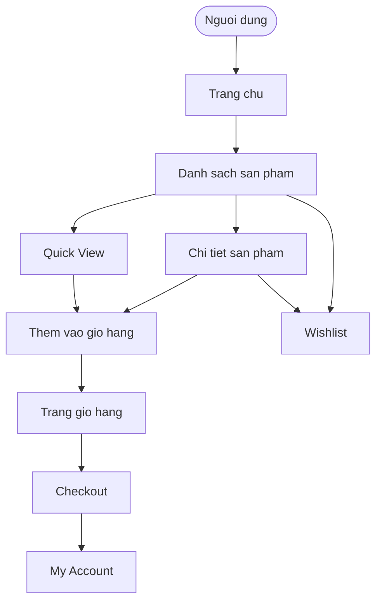
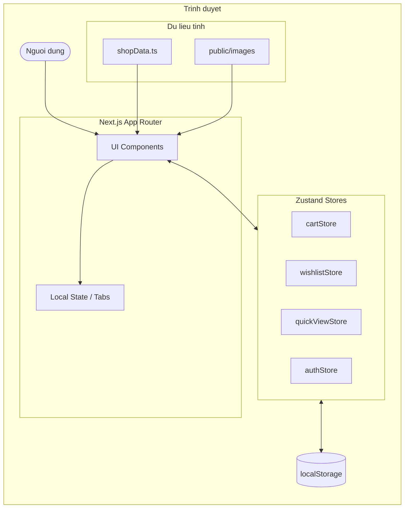
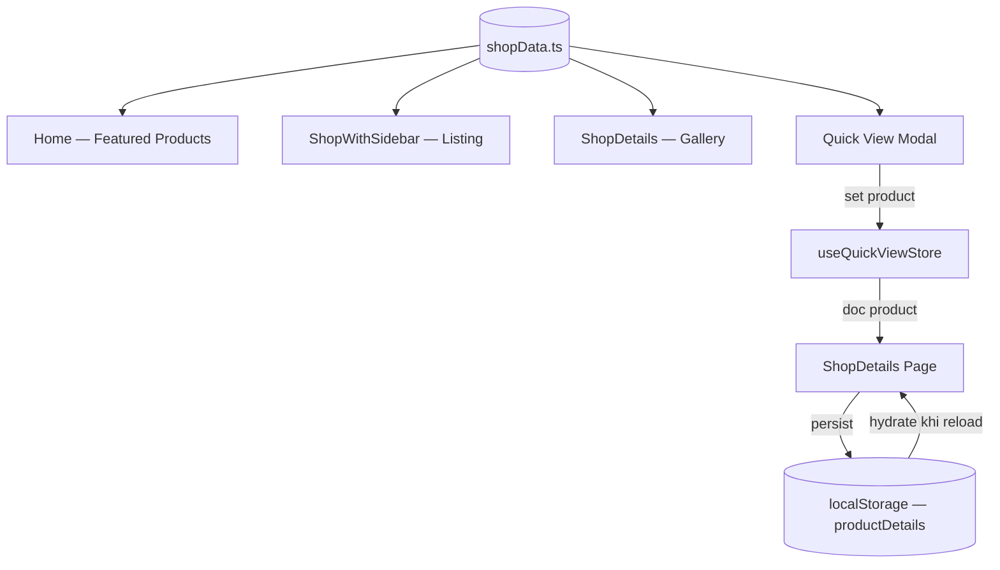
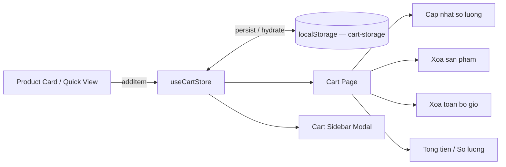
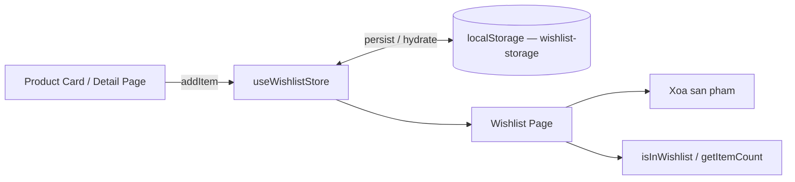
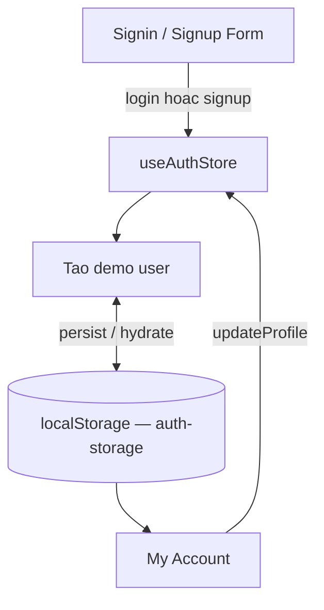
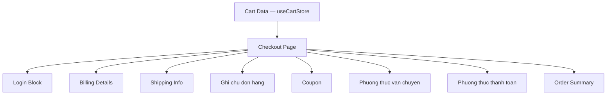
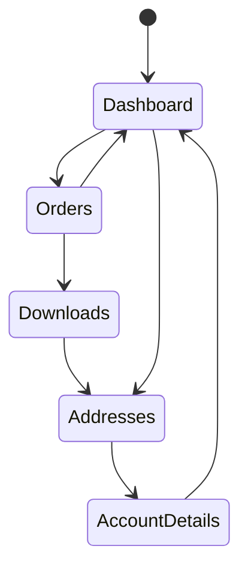
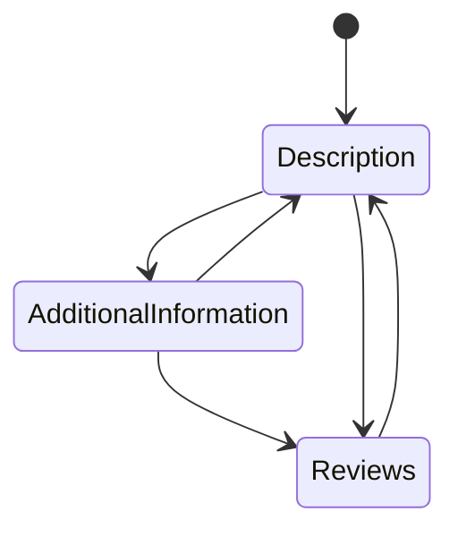
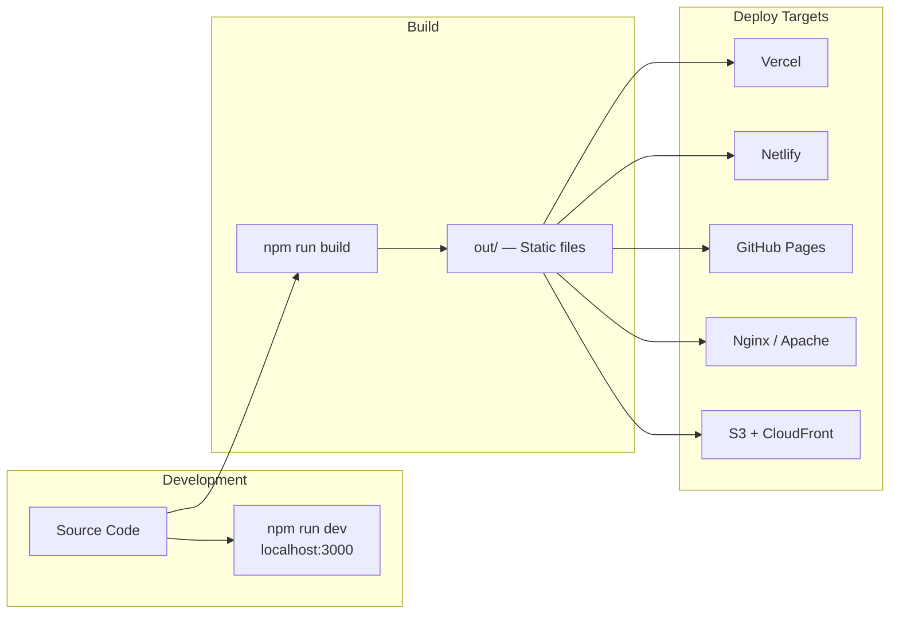

# Sơ đồ Mermaid — E-Commerce Frontend

---

## 1. Tổng quan luồng người dùng

---

## 2. Kien truc he thong

---

## 3. Luong du lieu san pham

---

## 4. Luong gio hang

---

## 5. Luong Wishlist

---

## 6. Luong Auth Demo

---

## 7. Luong Checkout

---

## 8. Luong tab My Account

---

## 9. Luong tab Chi tiet san pham

---

## 10. Luong Build va Deploy

---

# Giải thích sơ đồ

---

## 1. Tổng quan luồng người dùng

Sơ đồ mô tả hành trình điều hướng của người dùng qua toàn bộ hệ thống — còn gọi là navigation flow.

**3 luồng chính chạy song song:**

**Luồng mua hàng:** Người dùng vào trang chủ → duyệt danh sách sản phẩm → xem nhanh qua Quick View hoặc vào trang chi tiết → thêm vào giỏ → trang giỏ hàng → checkout → My Account.

**Luồng wishlist:** Từ danh sách hoặc trang chi tiết, người dùng lưu sản phẩm yêu thích mà không cần thêm vào giỏ. Wishlist và Cart hoàn toàn độc lập nhau — mỗi cái dùng một store riêng.

**Điểm hội tụ:** Cart là điểm hội tụ của cả Quick View lẫn Chi tiết sản phẩm. Cả hai đều gọi cùng một action `addItem` của `cartStore`, không có logic riêng biệt theo nguồn gọi.

---

## 2. Kiến trúc hệ thống

Sơ đồ phân tầng kiến trúc client-side. Toàn bộ hệ thống chạy trong trình duyệt — không có server runtime, không có API call ra ngoài.

**Tầng UI — Next.js App Router:**
Mỗi trang là một file `page.tsx` trong `src/app`. Component trong `src/components` được kéo vào page để render. Local state như trạng thái tab, toggle sidebar dùng `useState` ngay trong component — không đẩy lên store.

**Tầng state — Zustand Stores:**
Là lớp trung gian giữa UI và localStorage. Bốn store đang hoạt động: `cartStore`, `wishlistStore`, `quickViewStore`, `authStore`. Khi người dùng thao tác, UI gọi action của store — store cập nhật state — UI tự re-render theo state mới.

**Tầng dữ liệu — Static data:**
`shopData.ts` là nguồn dữ liệu sản phẩm duy nhất, được khai báo tĩnh trong code. Ảnh nằm trong `public/images/` và được tham chiếu bằng đường dẫn tuyệt đối từ root.

**Tầng persistence — localStorage:**
Zustand dùng middleware `persist` để tự động đồng bộ state xuống localStorage sau mỗi lần cập nhật. Khi người dùng reload trang, store tự đọc lại dữ liệu từ localStorage — gọi là hydration. Đây là lý do giỏ hàng và wishlist không mất sau khi refresh.

---

## 3. Luồng dữ liệu sản phẩm

Sơ đồ theo dõi một sản phẩm từ lúc được khai báo trong code đến lúc hiển thị ra UI và được lưu lại.

**Nguồn gốc:** Tất cả sản phẩm đều xuất phát từ `shopData.ts` — một mảng object TypeScript được khai báo tĩnh. Không có API call, không có database.

**Phân phối:** `shopData` được import trực tiếp vào từng component cần dùng. Home lấy vài sản phẩm đầu để hiển thị Featured. ShopWithSidebar lấy toàn bộ danh sách. ShopDetails và Quick View cũng đọc từ cùng nguồn này.

**Cơ chế Quick View → ShopDetails:**
Khi người dùng mở Quick View, component gọi `openQuickView(product)` — đẩy object sản phẩm vào `quickViewStore`. Khi người dùng chuyển sang trang ShopDetails, component đọc product từ store đó ra để render. Đây là cách truyền dữ liệu giữa hai trang mà không cần URL param hay API call.

**Cơ chế persist khi reload:**
ShopDetails dùng `useEffect` để ghi product hiện tại vào `localStorage` với key `productDetails`. Nếu người dùng reload trang, component đọc lại từ localStorage thay vì từ store — tránh mất dữ liệu khi store bị reset.

---

## 4. Luồng giỏ hàng

Sơ đồ theo dõi toàn bộ vòng đời của một item trong giỏ — từ lúc thêm vào đến lúc bị xóa.

**Thêm vào giỏ:**
Người dùng bấm nút từ Product Card hoặc Quick View → gọi `cartStore.addItem(product)` → Zustand cập nhật mảng `items` trong store → middleware `persist` tự động ghi xuống `localStorage` key `cart-storage`.

**Hiển thị:**
Cả Cart Page lẫn Cart Sidebar Modal đều subscribe vào cùng một `cartStore`. Khi store thay đổi, cả hai tự re-render — không cần truyền props hay event thủ công.

**Các thao tác trong Cart Page:**
- `updateQuantity(id, qty)` — cập nhật số lượng theo id sản phẩm.
- `removeItem(id)` — xóa một dòng khỏi mảng items.
- `clearCart()` — reset toàn bộ mảng về rỗng.
- `getTotal()` và `getItemCount()` — là getter thuần, tính toán từ state hiện tại, không lưu riêng.

**Hydration khi reload:**
Khi trang được load lại, Zustand đọc `cart-storage` từ localStorage và khôi phục lại mảng `items` — người dùng không mất giỏ hàng.

---

## 5. Luồng Wishlist

Cơ chế hoàn toàn tương tự Cart nhưng đơn giản hơn — không có updateQuantity vì wishlist chỉ lưu danh sách sản phẩm yêu thích.

**Thêm vào wishlist:**
Người dùng bấm icon tim từ Product Card hoặc trang chi tiết → gọi `wishlistStore.addItem(product)` → persist xuống `wishlist-storage`.

**Kiểm tra trạng thái:**
`isInWishlist(id)` trả về boolean — dùng để hiển thị icon tim đã fill hay chưa trên Product Card. `getItemCount()` dùng để hiển thị badge số lượng trên header.

**Xóa khỏi wishlist:**
Chỉ có `removeItem(id)` — không có clearAll vì hành vi xóa wishlist thường là xóa từng cái.

---

## 6. Luồng Auth Demo

Đây là hệ thống auth giả lập — không có backend, không có JWT, không có xác thực thật.

**Cơ chế hoạt động:**
Người dùng nhập email và password vào form → gọi `authStore.login()` hoặc `authStore.signup()` → store tạo một object user với các trường cơ bản (id, email, name) → lưu xuống `auth-storage`.

**Tại sao gọi là demo auth:**
Không có call API nào xảy ra. Bất kỳ email/password nào đáp ứng điều kiện tối thiểu (ví dụ không rỗng) đều được chấp nhận. Đây chỉ là mô phỏng giao diện và luồng UX của tính năng đăng nhập.

**Vòng lặp My Account:**
Sau khi đăng nhập, người dùng vào My Account → chỉnh sửa thông tin → gọi `authStore.updateProfile(data)` → store cập nhật object user → persist lại xuống localStorage. Đây là vòng lặp read-write duy nhất trong toàn bộ hệ thống auth.

**Rủi ro khi lên production:**
Nếu chuyển sang production thật, phần này phải được thay hoàn toàn bằng backend thật kèm xác thực token. Giữ nguyên cơ chế hiện tại sẽ không có bảo mật gì.

---

## 7. Luồng Checkout

Sơ đồ mô tả cấu trúc của trang Checkout — không phải một luồng tuần tự mà là một trang tổng hợp nhiều khối UI độc lập.

**Cấu trúc trang:**
Checkout Page nhận Cart Data đầu vào và render 8 khối song song: Login, Billing, Shipping, Notes, Coupon, Phương thức vận chuyển, Phương thức thanh toán, Order Summary.

**Điểm quan trọng cần lưu ý:**
Phần Order Summary hiện đang hard-code — không đọc động từ `cartStore`. Đây là điểm còn thiếu trong implementation hiện tại. Nếu người dùng thêm/xóa sản phẩm trong giỏ rồi vào Checkout, phần tóm tắt đơn hàng sẽ không khớp với giỏ thật.

**Toàn bộ Checkout là form mô phỏng:**
Không có payment gateway, không có order API. Submit form không thực sự tạo đơn hàng. Mục đích là trình diễn luồng UX và giao diện.

---

## 8. Luồng tab My Account

Sơ đồ trạng thái mô tả cách người dùng điều hướng giữa các tab trong trang My Account.

**Cơ chế:**
Tab state được quản lý bằng `useState` trong component `MyAccount/index.tsx` — không dùng store hay URL param. Khi người dùng click tab, `activeTab` được cập nhật và component render nội dung tương ứng theo điều kiện.

**Các trạng thái:**
- `Dashboard` — thông tin tổng quan tài khoản.
- `Orders` — danh sách đơn hàng, có modal chi tiết.
- `Downloads` — nội dung tải về.
- `Addresses` — quản lý địa chỉ, mở `AddressModal`.
- `AccountDetails` — chỉnh sửa thông tin cá nhân và đổi mật khẩu.

**Luồng vòng lặp:**
`AccountDetails → Dashboard` tạo thành chu kỳ khép kín — người dùng có thể điều hướng tự do giữa các tab mà không bị giới hạn thứ tự.

---

## 9. Luồng tab Chi tiết sản phẩm

Sơ đồ trạng thái mô tả 3 tab nội dung trong trang ShopDetails.

**Cơ chế tương tự My Account:**
Tab state dùng `useState` local trong `ShopDetails/index.tsx`. Không có route riêng cho từng tab — tất cả render trong cùng một trang.

**3 trạng thái:**
- `Description` — mô tả sản phẩm, mặc định hiển thị khi vào trang.
- `AdditionalInformation` — thông số kỹ thuật, tùy chọn cấu hình.
- `Reviews` — đánh giá người dùng kèm form gửi review.

**Vòng lặp:**
Các tab có thể chuyển qua lại tự do theo bất kỳ thứ tự nào — không có ràng buộc thứ tự hay điều kiện.

---

## 10. Luồng Build và Deploy

Sơ đồ mô tả pipeline từ lúc viết code đến lúc hệ thống chạy trên môi trường thật.

**Development:**
Chạy `npm run dev` để khởi động Next.js dev server tại `localhost:3000`. Hỗ trợ hot reload — chỉnh code là trình duyệt tự cập nhật ngay.

**Build:**
Chạy `npm run build` — Next.js compile toàn bộ source thành file tĩnh HTML, CSS, JavaScript thuần và đẩy vào thư mục `out/`. Cấu hình `output: 'export'` trong `next.config.js` là điều kiện bắt buộc để bước này hoạt động đúng.

**Tại sao là static export:**
Vì không có backend, không có server logic động — toàn bộ data đã được nhúng vào code lúc build. Static export cho phép deploy lên bất kỳ hosting tĩnh nào mà không cần Node.js runtime trên server.

**Deploy targets:**
Thư mục `out/` có thể được đẩy lên Vercel, Netlify, GitHub Pages, Nginx/Apache, hoặc S3 + CloudFront. Tất cả đều chỉ cần serve file tĩnh — không cần cấu hình server đặc biệt.