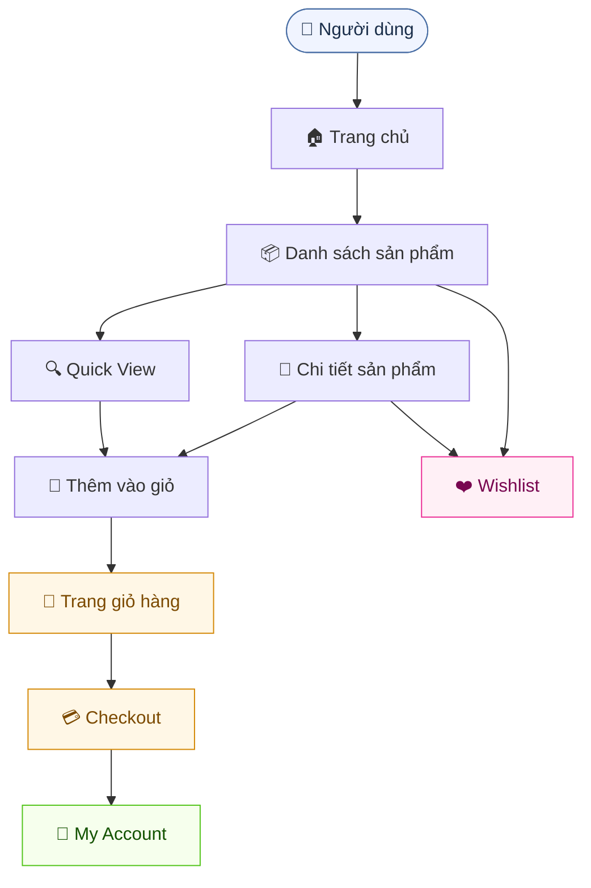
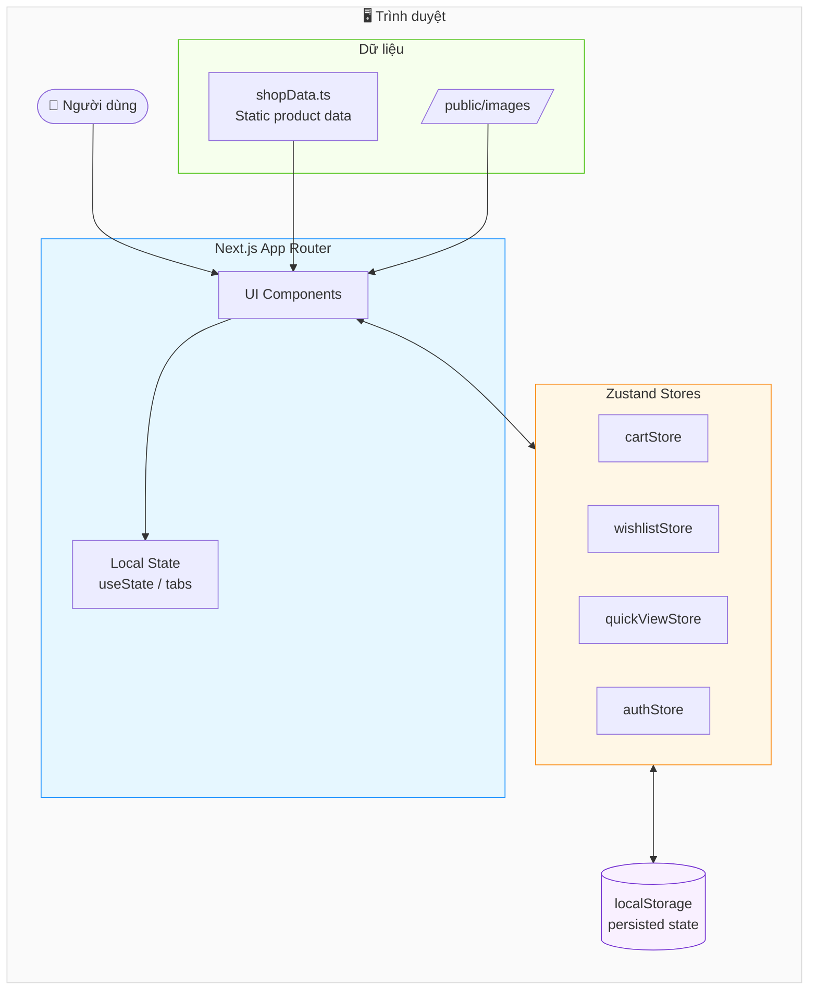
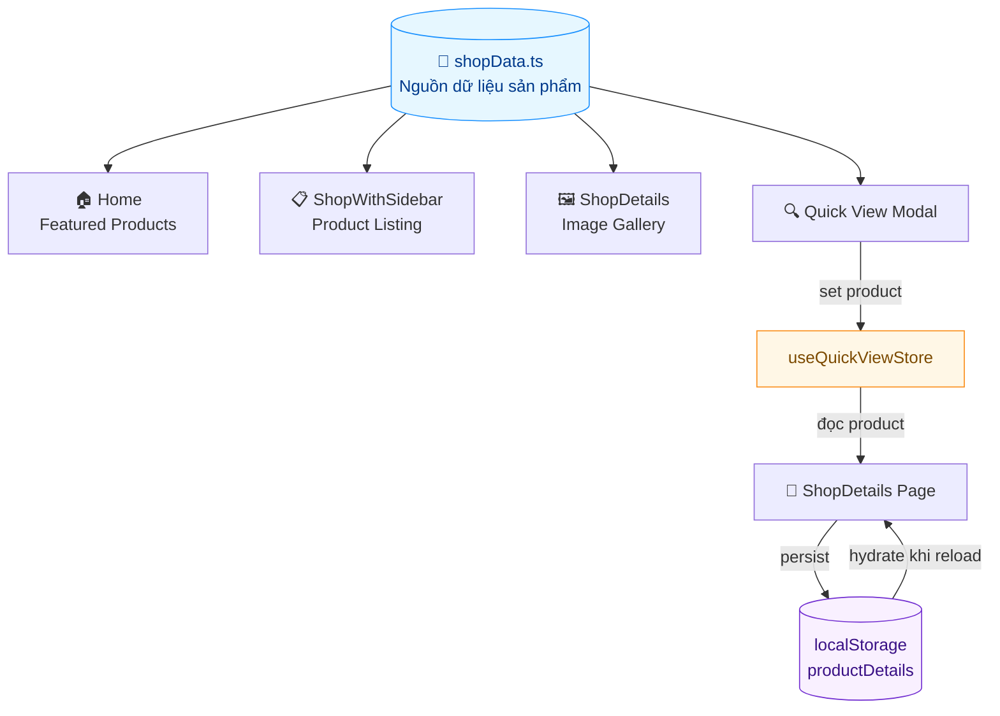
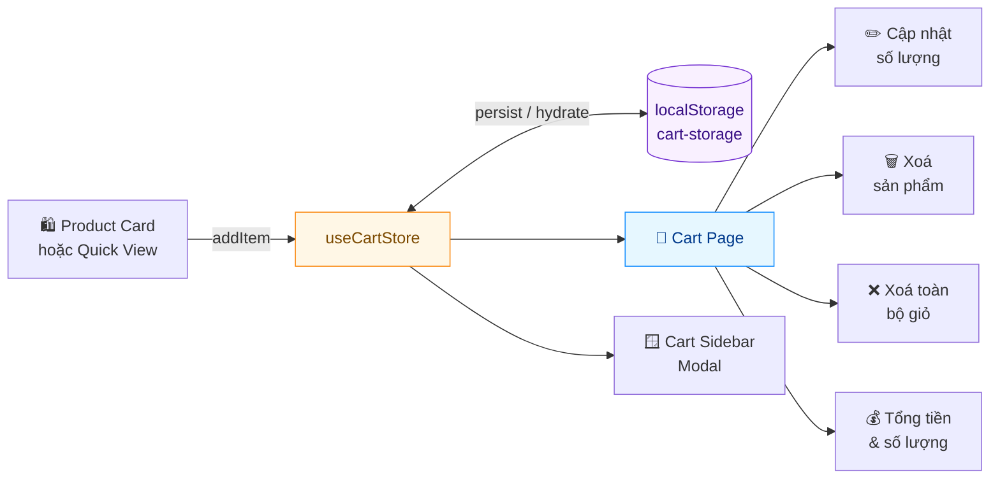
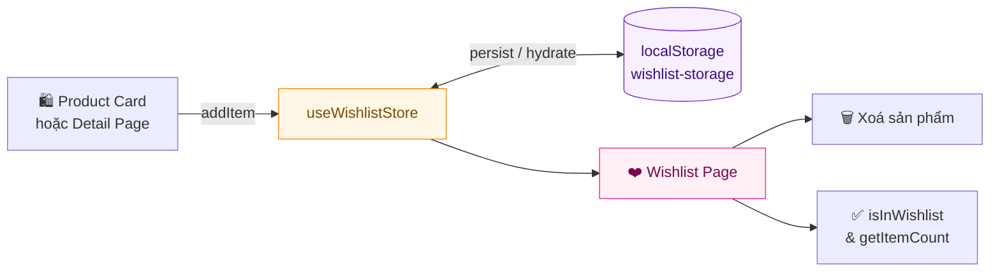
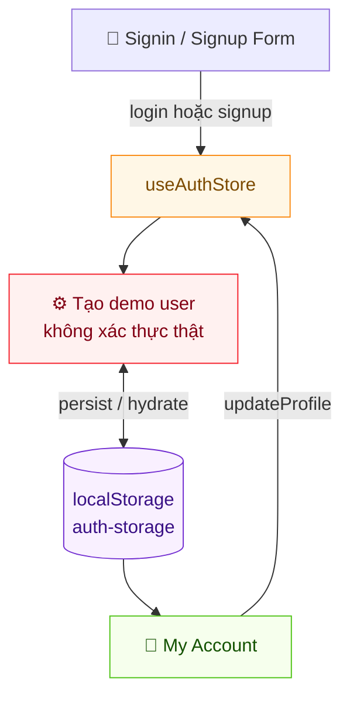
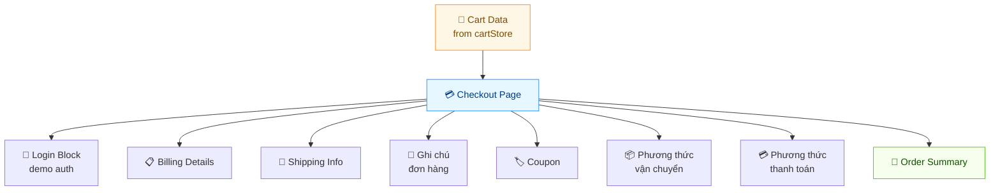
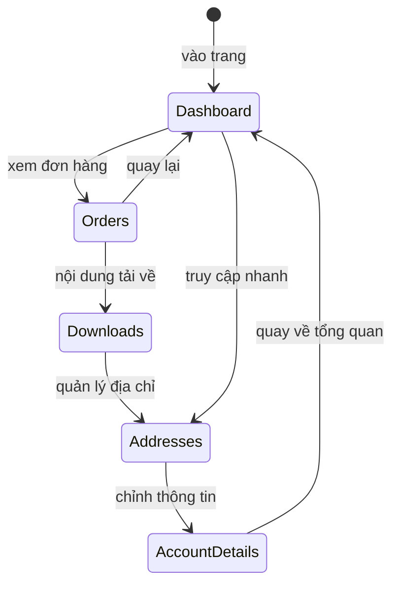
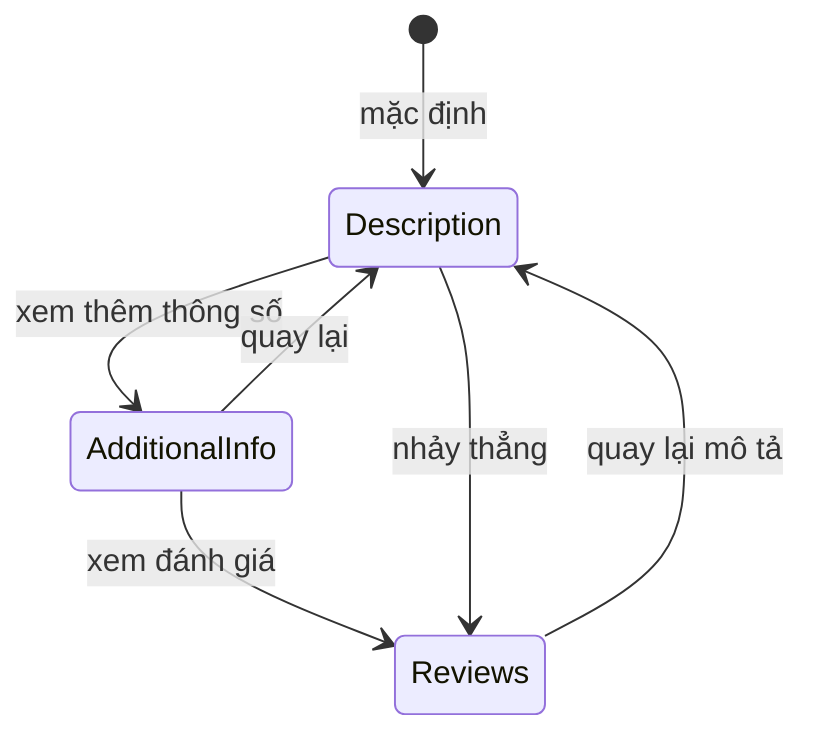

# Sơ đồ Mermaid — E-Commerce Frontend

---

## 1. Tổng quan luồng người dùng



---

## 2. Kiến trúc hệ thống



---

## 3. Luồng dữ liệu sản phẩm



---

## 4. Luồng giỏ hàng



---

## 5. Luồng Wishlist



---

## 6. Luồng Auth Demo



---

## 7. Luồng Checkout



---

## 8. Luồng tab My Account



---

## 9. Luồng tab Chi tiết sản phẩm



---

## 10. Luồng Build & Deploy

```mermaid
flowchart LR
    subgraph Dev["💻 Development"]
        Src[Source Code\nNext.js + React + TS]
        Dev2[npm run dev\nlocalhost:3000]
        Src --> Dev2
    end

    subgraph Build["⚙️ Build"]
        Src2[npm run build]
        Out[/out/ \nStatic HTML/CSS/JS]
        Src2 --> Out
    end

    subgraph Deploy["🚀 Deploy Targets"]
        Vercel[Vercel]
        Netlify[Netlify]
        GHP[GitHub Pages]
        Nginx[Nginx / Apache]
        S3[S3 + CloudFront]
    end

    Src --> Src2
    Out --> Vercel
    Out --> Netlify
    Out --> GHP
    Out --> Nginx
    Out --> S3

    style Dev fill:#e6f7ff,stroke:#1890ff
    style Build fill:#fff7e6,stroke:#fa8c16
    style Deploy fill:#f6ffed,stroke:#52c41a
```