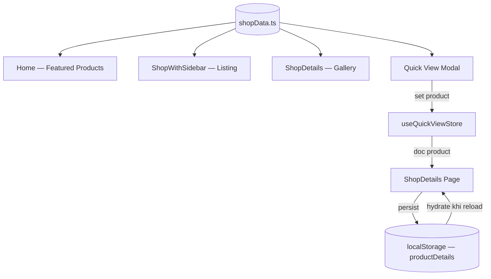
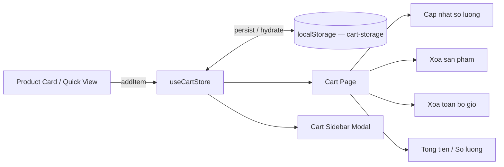
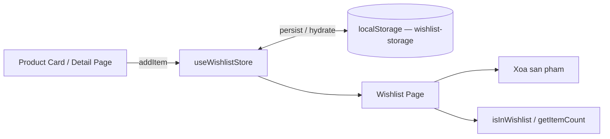
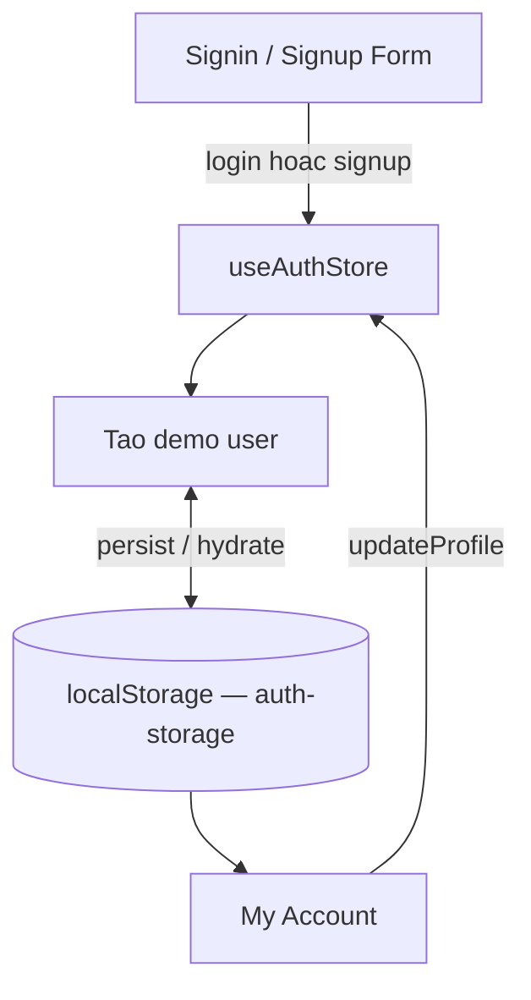
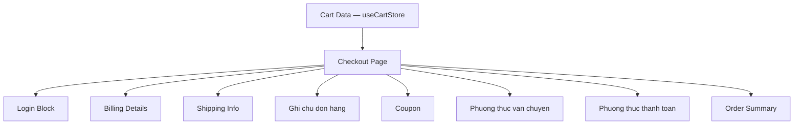
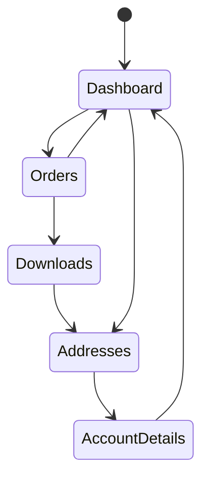
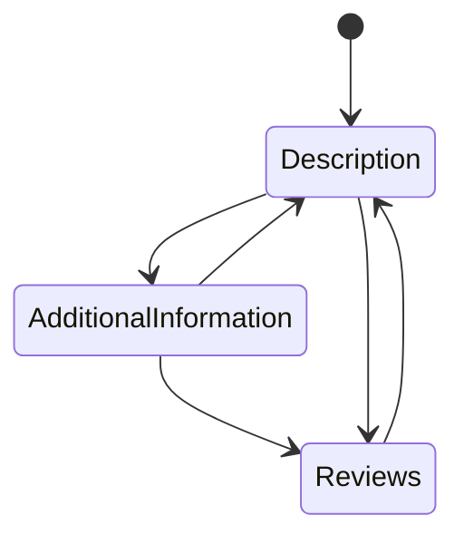
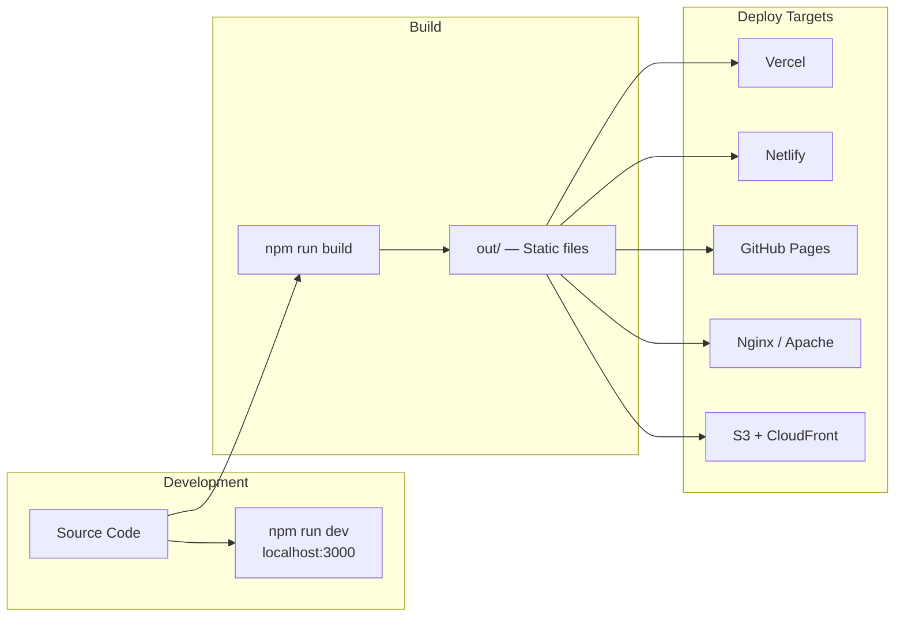

# Sơ đồ Mermaid — E-Commerce Frontend

---

## 1. Tổng quan luồng người dùng

---

## 2. Kien truc he thong

---

## 3. Luong du lieu san pham

---

## 4. Luong gio hang

---

## 5. Luong Wishlist

---

## 6. Luong Auth Demo

---

## 7. Luong Checkout

---

## 8. Luong tab My Account

---

## 9. Luong tab Chi tiet san pham

---

## 10. Luong Build va Deploy

